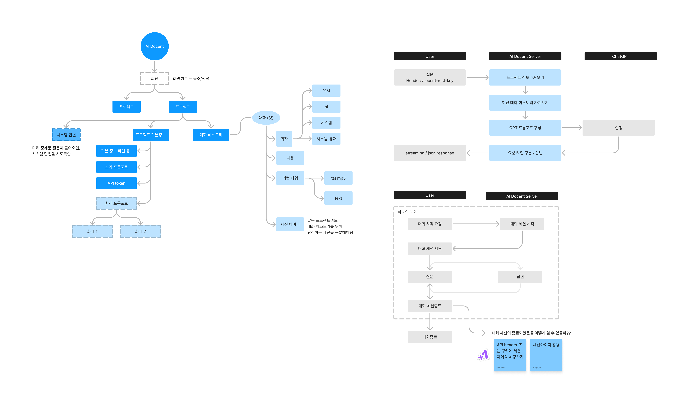
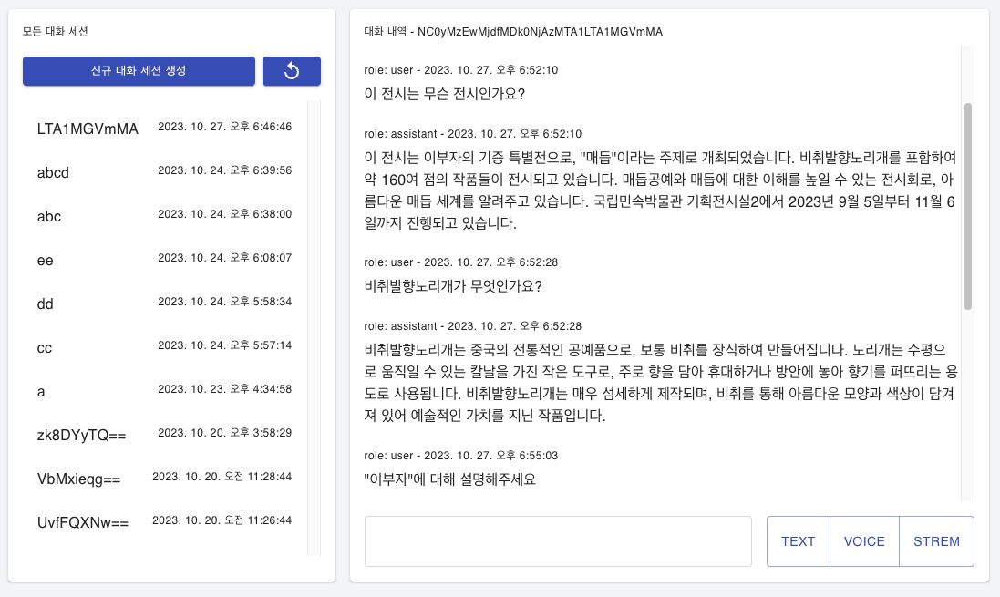
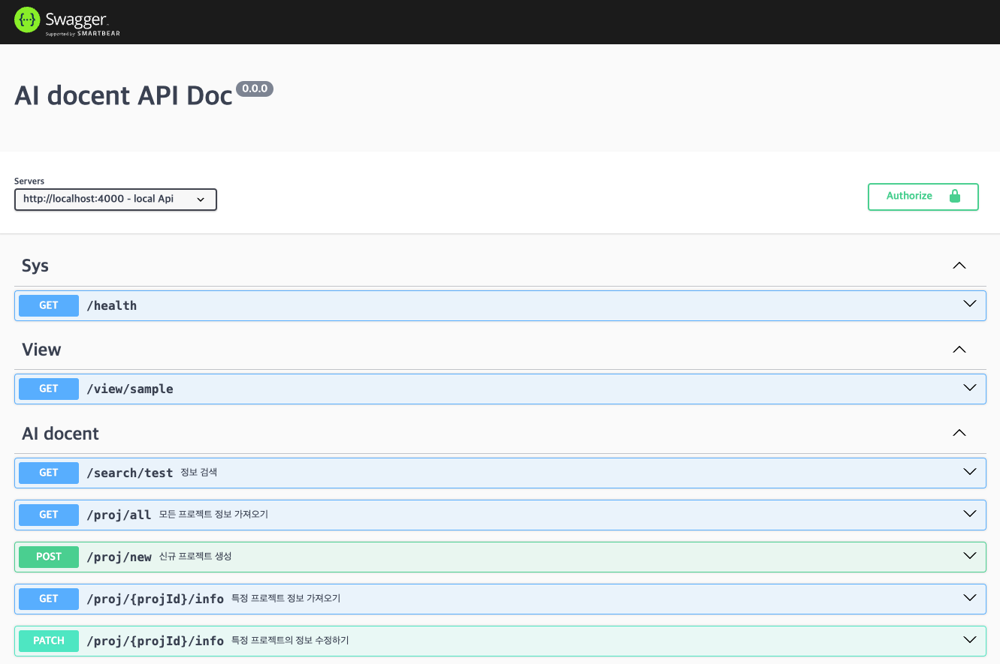

# AI Docent Micro




#### Script

- macOS 또는 Linux 환경에서만 사용 가능함
- window일 경우 `.bat` 파일을 따로 만들어야 함

```bash
# .env.local 환경으로 실행
$ npm run start:local

# .env.dev 환경으로 실행
$ npm run start:dev

# .env.prod 환경으로 실행
$ npm run start:prod

# .env.dev 환경으로 빌드
$ npm run build:dev

# .env.dev 환경으로 배포
$ npm run deploy:dev


# ncp production 환경
$ npm run build:prod
$ pm2 start
$ pm2 reload aidocent-api
```

#### API document

- swagger를 사용해 관리
- ID/PASSWORD 입력
  - `.env` 환경파일에 있는 `SWAGGER_USER/SWAGGER_PWD` 참고
- 접근 제한이 있는 API일 경우 해더에 Project Rest Api Key를 넣어 요청해야한다.
  - 자세한건 Swagger 참고


